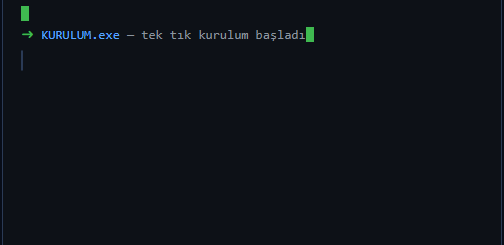
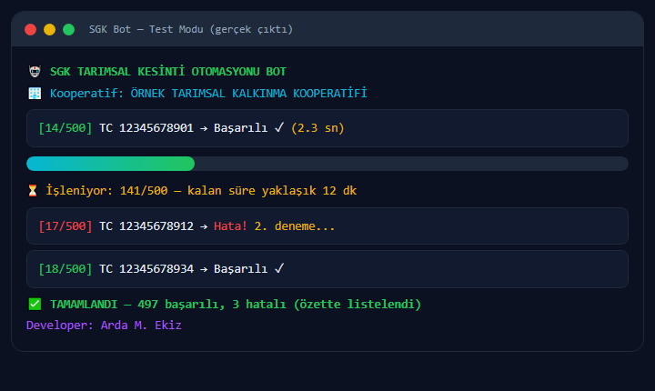
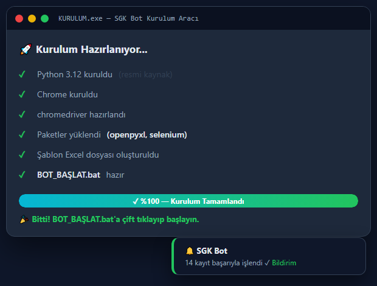

# 🌾 SGK Tarımsal Kesinti Botu

SGK Bağ-Kur tarımsal faaliyet bildirimi işlemlerini **otomatikleştiren** Selenium tabanlı masaüstü botu.
Excel'deki üretici listesini okur, SGK sayfasında tek tek işler ve işlem sonucunu ekranda raporlar.


[](https://github.com/ArdaEkiz0/e-kesinti-otomasyon/releases)
[](https://github.com/ArdaEkiz0/e-kesinti-otomasyon/releases)
[](https://github.com/ArdaEkiz0/e-kesinti-otomasyon)
[](https://github.com/ArdaEkiz0/e-kesinti-otomasyon/actions)
[](https://ardaekiz0.github.io/e-kesinti-otomasyon/)
[](https://github.com/ArdaEkiz0/e-kesinti-otomasyon/commits/main)

---

## 🎬 Canlı Demo



Terminal akışı: tek tık kurulum → Excel okunur → kayıtlar tek tek işlenir → sonuç raporlanır.

---

## 📸 Ekran Görüntüleri

| Bot çalışırken | Kurulum aracı |
| :---: | :---: |
|  |  |

---

## 🌐 Tanıtım Sayfası

👉 **https://ardaekiz0.github.io/e-kesinti-otomasyon/**

İndirme, özellikler, kullanım kılavuzu ve SSS'nin tamamı tek sayfada

---

## ✨ Özellikler

- ⚡ **Tek Tık Kurulum** — `KURULUM.exe` Python, Chrome, chromedriver ve paketleri kendisi kurar
- 🔄 **Otomatik Güncelleme** — kurulum aracı açılışta GitHub'dan yeni sürüm olup olmadığını kontrol eder, varsa kendini günceller
- 📊 **Renkli ve İlerlemeli Arayüz** — her kayıt için ilerleme çubuğu, yeşil/kırmızı durum mesajları
- 🔄 **Otomatik Tekrar Deneme** — hata olan kayıt 3 kez denenir (site yavaşsa başarı oranı artar)
- 🔔 **Windows Bitiş Bildirimi** — işlem bitince ekrana bakmadan bildirimle öğrenirsin
- 📁 **Herhangi Bir Excel'i Kullan** — adı ne olursa olsun Excel dosyasını seç ya da sürükle-bırak
- 🧪 **Test Modu** — gerçek işlem yapmadan (sahte sürücü ile) uygulamanın çalıştığını dener
- 🧹 **Otomatik Temizlik** — eski sürücü kilitlerini temizler, sürücü bulunamazsa yerel yedeğe düşer

---

## 🚀 Kurulum

### Seçenek 1: KURULUM.exe ile (Önerilen)

1. `KURULUM.exe` dosyasını indir
2. Çift tıkla, **6 adımı otomatik yapar**:
   - Bot dosyalarını kontrol eder (sgk_bot.py, BAT_BASLAT.bat)
   - Python 3.9+ kontrolü (yoksa kurar)
   - Gerekli paketler: `selenium`, `pandas`, `openpyxl`, `webdriver-manager`
   - Google Chrome kontrolü (yoksa kurar)
   - chromedriver'ı Chrome sürümüne göre indirir
   - Şablon Excel dosyasını oluşturur

### Seçenek 2: Kaynaktan çalıştırma

```bat
git clone https://github.com/ArdaEkiz0/e-kesinti-otomasyon.git
cd e-kesinti-otomasyon
python -m pip install -r requirements.txt
python sgk_bot.py
```

> 📌 Bağımlılıkları tek tek kurmak yerine `requirements.txt` kullanılır; kurulum aracı (`KURULUM.py`) zaten bu paketleri otomatik kurar.

### Seçenek 3: Profesyonel GUI EXE (Önerilen)

Profesyonel arayüz (`sgk_app.py`) tek EXE haline derlenir — PyQt5 GUI, lisans kontrol,
işlem logu, durum izleme ve ayni SGK bot entegrasyonda. GitHub Actions'a her `v*` tag
için otomatik derlir ve release'ye yuklir:

1. **Derlen EXE**: `SGK_E_Kesinti_Otomasyon.exe` (Release sayfasıda)
2. Çift tıkla açılır — lisans (HWID + IP) sunucu tarafindan dogrulır
3. Excel dosyasına seç ve **Baslat** butonuna basin

**Yerelde derlemek için:**
```bat
pip install pyinstaller pyqt5 -r requirements.txt
pyinstaller --noconfirm --clean sgk_app.spec
```

> 📌 Lisans sunucu (`api_client.py`'de `WORKER_URL`) exe'de doğrulma
> açılma açılma HWID ve IP'i kaydet — bu profesyonel lisans modeludur.

---

## 📄 Excel Formatı

Uygulama şu sütunlara sahip bir Excel dosyası bekler (şablonu kurulum otomatik oluşturur):

| Sütun | İçerik |
|-------|--------|
| **Ünvan** | Üretici adı (yazılması zorunlu değil) |
| **TC Kimlik No** | 11 haneli TC kimlik numarası |
| **Matrah** | Alım bedeli (ondalık kısmı virgülle: `13014,09`) |
| **Bağ-Kur** | Kesinti tutarı (hesaplanır) |

---

## 🖥️ Kullanım

1. Excel dosyanı hazırla (veya şablonu kullan)
2. `BAT_BASLAT.bat` dosyasına **çift tıkla** — dosyayı sorar
3. **Daha kolay:** Excel dosyanı `BAT_BASLAT.bat` üzerine **sürükle-bırak**
4. Bot SGK sayfasını açar, kayıtları tek tek işler ve raporu ekranda gösterir

### Test Modu

```bat
python sgk_bot.py --test
```

Sayfa açmadan, sahte sürücü ile tüm akışın çalıştığını doğrular.

---

## ❓ Sık Karşılaşılan Sorunlar

| Sorun | Çözüm |
|-------|-------|
| Bot açılmıyor / sürücü hatası | `KURULUM.exe` yeniden çalıştır (Chrome güncellenmiş olabilir) |
| Kuruş yanlış yazılıyor (ör: `13014,90`) | Bu botun eski sürüm sorunudur; güncel sürümde kuruş her zaman 2 haneli (`09`) yazılır |
| Sayfa elemanı bulunamadı | SGK sitesi değişmiş olabilir — sürümü kontrol et |

---

## 🤝 Katkı

Geliştirmeler, hata bildirimleri ve öneriler her zaman açıktır. Nasıl katkı sağlayacağını gör:

- 👉 [CONTRIBUTING.md](CONTRIBUTING.md) — katkı rehberi ve hata bildirimi şablonu
- 💬 [Discussions](https://github.com/ArdaEkiz0/e-kesinti-otomasyon/discussions) — soru, öneri ve geri bildirim
- 🐛 [Issues](https://github.com/ArdaEkiz0/e-kesinti-otomasyon/issues) — hata bildirimi ve geliştirme talebi

---

## 👨‍💻 Geliştirici

**Arda M. Ekiz** — GitHub: [ArdaEkiz0](https://github.com/ArdaEkiz0)
